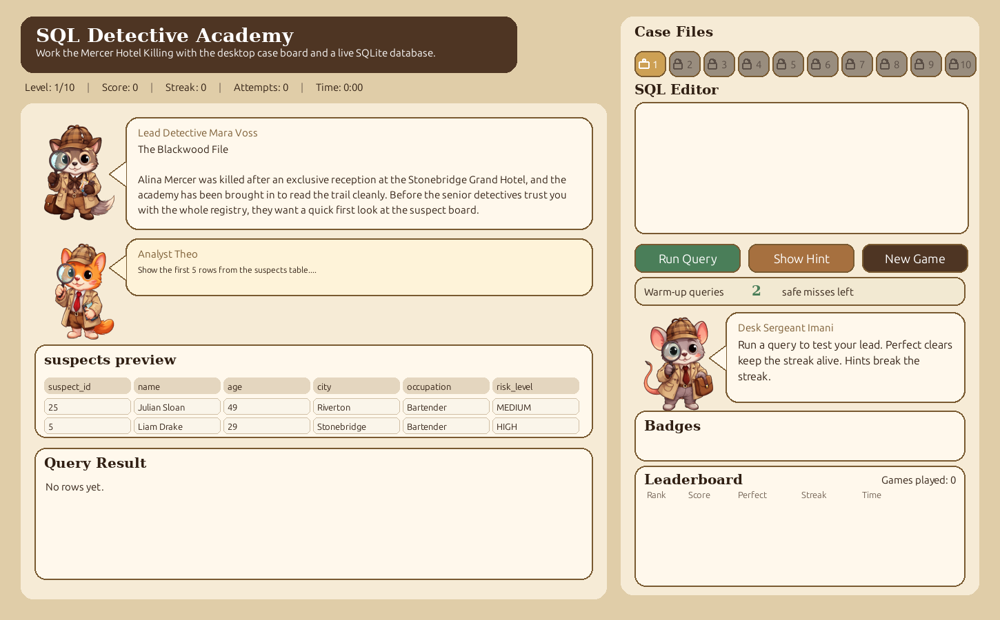

# SQL Detective Academy

SQL Detective Academy is a desktop SQL learning game built with `pygame` and backed by a real SQLite database. You play through a detective story, solve cases by writing real `SELECT` queries, and learn SQL by testing your ideas against live data.



## Play The Game

Download the desktop build for your operating system:

- Linux: [SQLDetectiveAcademy-linux-x86_64.tar.gz](https://github.com/Bershco/detective-pygame-learn-SQL/releases/download/V1.1/SQLDetectiveAcademy-linux-x86_64.tar.gz)
- Windows: [SQLDetectiveAcademy-windows-x86_64.zip](https://github.com/Bershco/detective-pygame-learn-SQL/releases/download/V1.1/SQLDetectiveAcademy-windows-x86_64.zip)

Install steps:

1. Download the archive for your operating system.
2. Extract it.
3. Open the `SQLDetectiveAcademy` executable inside the extracted folder.

## What You Learn

The game is structured as a 10-level progression:

1. `SELECT *` and `LIMIT`
2. selecting specific columns
3. `WHERE`
4. combining `WHERE` conditions
5. `ORDER BY` and `LIMIT`
6. basic aggregation
7. `GROUP BY`
8. `JOIN`
9. `JOIN` with filtering
10. final evidence queries

Each run keeps the detective theme and case flow, while varying the exact challenge content so the game is less repetitive.

## Current State Of This Repo

This repository currently contains the desktop game itself, the SQLite-backed challenge data, the packaging configuration for desktop builds, and the GitHub Actions workflow that builds release artifacts for Linux and Windows.

For players, the most useful thing here is the release download above. For developers, the repo contains the full source code used to build those desktop releases.

## Run From Source

If you want to run the project from source instead of downloading a packaged build:

```bash
pip install -r requirements.txt
python3 desktop_app.py
```

To build the desktop package yourself:

```bash
pip install -r requirements-packaging.txt
python3 build_release.py
```

## Design Choices And Teaching Goals

This platform was designed as a game first and a SQL worksheet second. The main idea was to make SQL feel like part of solving a case, not like filling in answers on a quiz page. That is why the final version is a desktop `pygame` application with a detective board layout, a story context, visible table previews, and a real SQL editor.

A second important choice was validating query results instead of comparing SQL strings. In practice, SQL often has more than one correct solution, so this approach makes the game feel fairer and more useful as a learning tool. As long as the player writes a safe `SELECT` query that returns the correct result, the level can be solved.

The teaching progression is meant to move from simple retrieval to more structured reasoning. The early levels focus on reading tables and filtering rows, the middle levels introduce ordering and aggregation, and the later levels move into grouping and joins. The goal is that by the end of the game, the player is not just memorizing syntax, but actually thinking in terms of how to extract evidence from relational data.
